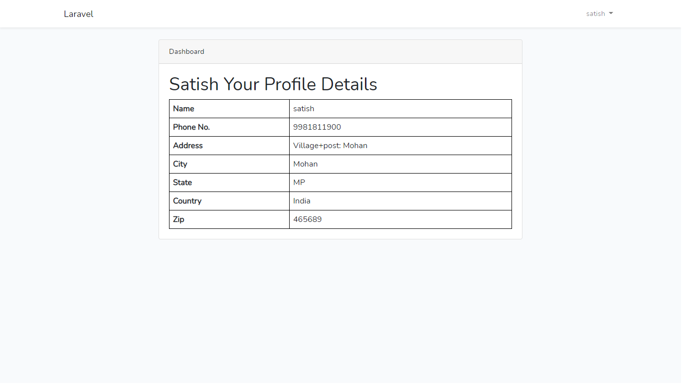
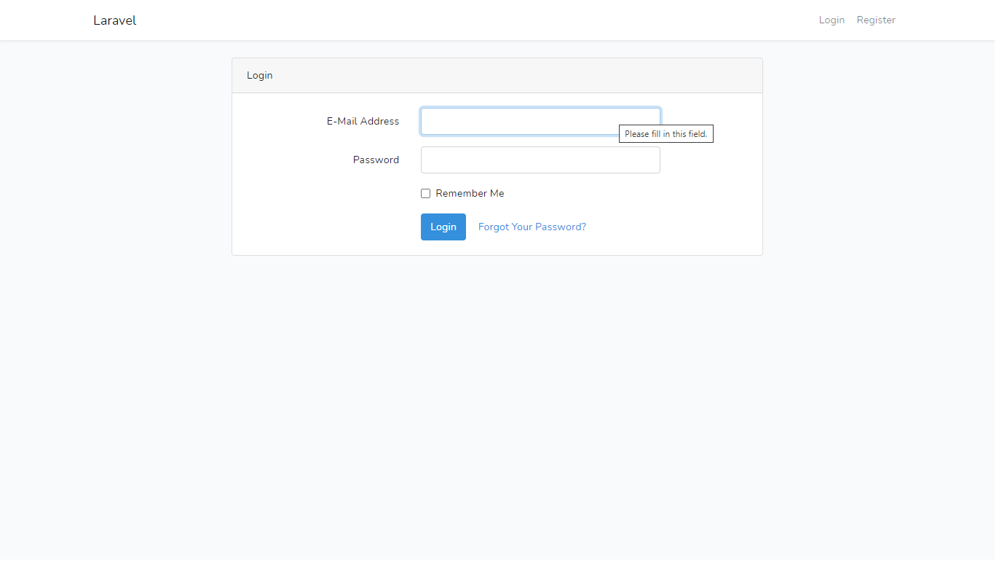

<body>
    

        

            <h1>Contact Details</h1>
        

        

            <table style='widht:100%'>
                <tr style="border">
                    <th>Name</th>
                    <td>Satish Lovewanshi</td>
                </tr>
                <tr style="border">
                    <th>Mobile</th>
                    <td>+91 9981811900</td>
                </tr>
                <tr style="border">
                    <th>Gmail</th>
                    <td>satishlovewanshi1900@gmail.com</td>
                </tr>
            </table>
        

    

</body>
<body>
    

        

            <h1>Requirement For Run The Project</h1>
        

        

            <ul>
                <li>Install Php , Composer , Laravel ,MySql</li>
                <li>Import database form codeacious.sql file this file exist in project root directory</li>
                <li>Run artisan commad "php artisan serve"</li>
                <li>If face any Problem update the composer</li>
            </ul>
        

    

</body>
<body>
    

        

            <h1>Screenshots </h1>
        

        

            </img>
            </img>
            </img>
        

    

</body>
